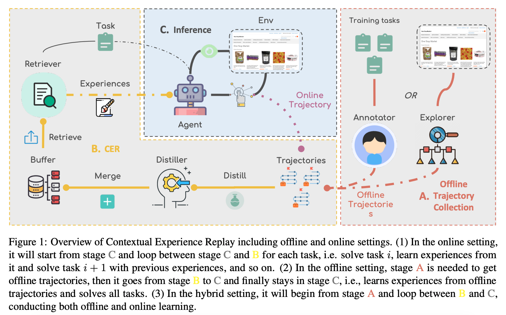

## Motivation and Problem Statement
Language agents (e.g., GPT-based web navigators) can perform tasks like shopping, posting, or searching across websites. However, even state-of-the-art systems achieve only ~20% success on benchmarks like WebArena and VisualWebArena, while humans reach 78–88%.
The main issue: Agents lack prior, environment-specific knowledge, forcing them to re-explore from scratch each time.  

It is resource-intesive to fine-tune an agent for each environment, and there's no mechanism for continual learning at inference time. The agent forgets what it learned after each episode. Thus, the authors propose Contextual Experience Replay (CER) - a way for an agent to learn continuously from its own trajectories, without retraining.  

**Core Idea of CER** 

Inspired by experience replay in reinforcement learning, CER introduces an in-context replay mechanism for LLM agents.  

The core cycle:  
• Distill knowledge from past trajectories into “experiences.”  
• Store those experiences in a dynamic memory buffer.  
• Retrieve relevant experiences for a new task.  
• Replay (inject) them into the LLM’s context before generating actions.  
• This allows self-improvement at inference time, purely through prompt-based learning (no parameter updates).  

## System Architecture

**Distillation Module**   
• Input: Full trajectories (state–action–observation logs).  
• Output: Two experience types:  
• Environment Dynamics: Summaries of how the website behaves (e.g., “Clicking ‘Next’ loads product details”).  
• Skills: Abstract, reusable procedural patterns (e.g., “Navigate to {forum name} → Click ‘New Post’ → Submit”).  
• The distiller uses an LLM to abstract and generalize each trajectory, writing results in natural language form.  
• It also references the existing buffer to avoid redundancy and ensure continual accumulation.  

**Experience Buffer**  
• A memory repository that accumulates distilled knowledge.  
• Each entry contains metadata (domain, context, task type) for retrieval indexing.  

**Retriever Module**  
• Uses semantic similarity search to select top-k relevant experiences for a given new task.  
• Retrieval is separated for skills and dynamics.  
• The selected experiences are converted to natural language summaries, which are then integrated into the model’s prompt.  

**Decision-Making with Contextual Replay**  
• Retrieved experiences are mapped to a natural language form.  
• These are merged into the current context 𝐶 to create an augmented prompt.  
• The LLM now reasons with prior context and produces more accurate, efficient actions.  

**Online, Offline, and Hybrid Learning Modes**  
• Online: Agent starts with zero experience; learns after each task. Self-generated during inference.  
• Offline: Experiences distilled from pre-collected trajectories; no new learning during inference.	Human-annotated or LLM-generated logs.  
• Hybrid": Starts with offline experience, continues to learn online. Both offline and self-generated.  

 

Even when trained with failed trajectories, CER still improved baseline performance — meaning the LLM distillation step is capable of extracting useful partial skills from imperfect data.  

**Analysis of Key Components** 
• Skill Distillation: Encodes procedural reasoning (steps, actions).Boosts generalization to unseen tasks.  
• Dynamics Distillation: Encodes environment interaction patterns (state transitions). Speeds up navigation and contextual understanding.  
• Replay Integration: Contextually inserts past experiences.Improves token efficiency and reasoning depth.  

**Insight** 
LLMs already perform in-context learning — they can adapt based on the structure of their prompt. CER leverages this by turning long-term memory into natural language context.
Thus, it transforms episodic experiences into explicit prompts, guiding future reasoning steps.  

It approximates the benefit of experience replay in RL (which reuses old trajectories to stabilize learning) but without gradient updates — making it practical for inference-time improvement.  

**Difference between Reflexion** 
Reflexion is designed to make an LLM self-correct within an episode (or a small number of retries). It adds a meta-cognitive feedback loop — after the agent completes (or fails) a task, it generates a natural language reflection. So Reflexion is: 1. Local: Focused on iterative self-improvement inside a single task or short-term retry cycle. 2. Episodic: The reflections typically vanish once the environment resets. 3. Reactive: It triggers reflection after failure. 4. Shallow memory: No persistent or structured long-term knowledge.  

CER extends beyond this “single-task reflection” into persistent, structured, cross-task learning. It formalizes reflection into two explicit knowledge types (skills, dynamics). It adds a retrieval mechanism so these reflections can be re-used contextually later. It creates a scalable memory substrate that grows and evolves with experience. 

                     +----------------------+
                     |  Reflexion           |
                     |  (Self-Feedback Loop)|
                     +----------------------+
                                ↓
                 (Distill experiences persistently)
                                ↓
                     +----------------------+
                     |  CER                |
                     |  (Cross-task self-  |
                     |   improvement loop) |
                     +----------------------+
                                ↓
                  (Store/retrieve at scale with memory)
                                ↓
                     +----------------------+
                     |  Memory Layer Infra  |
                     |  (Vector DB, RAG)    |
                     +----------------------+

CER represents a bridge between “stateless chat” and “stateful learning.”
The next generation of persistent agents (like LangGraph stateful DAG agents, or DSPy’s learned retrieval policies) could integrate CER-style distillation as a new memory layer type, enabling:  

• Structured knowledge formation — not just embeddings.  
• Task-conditioned retrieval — relevant experience replay.  
• Continual, parameter-free learning — inference-time self-improvement.  

## References
• Contextual Experience Replay for Self-Improvement of Language Agents. arXiv: [https://arxiv.org/pdf/2506.06698]

