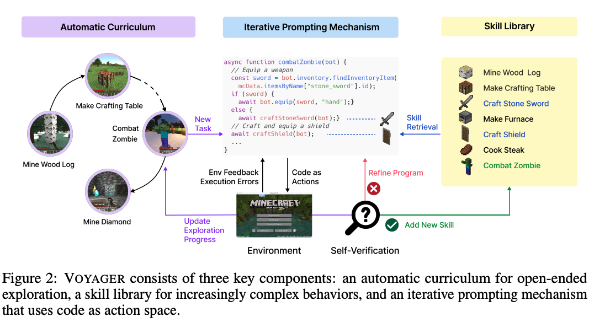

## Motivation and Problem Statement
The motivation stems from the limitations of current AI in complex, interactive, and open-ended environments.  

• Gap between Declarative and Proceduarl Knowledge: LLMs excel at reasoning (declarative knowledge) but often struggle with interactive, physical tasks (procedural knowledge). 
• Limitations of Traditional RL: Traditional RL agents are often black boxes, require vast amount of data, and struggle with catastrophic forgetting and generalization in lifelong learning scenarios.  
• Need for Open-Ended Explorations: Existing LLM-based agents often struggle with open-ended exploration, progressive skill acquisition, and generalizing learned behaviors to novel situations.  

**Core Idea of Voyager** 
The paper VOYAGER introduces a novel LLM-powered agent designed for lifelong learning and open-ended exploration in the Minecraft environment.  

## System Architecture 
Voyager consists of three novel components that work together to enable lifelong learning:
• Automatic Cirriculum: Generates a sequence of progressively challenging tasks for the agent. It is dynamically generated by GPT-4, which considers the agent's current state (inventory, exploration progress, completed skills) to propose tasks that maximize novelty and exploration.   
• Skill Library: Stores and manages executable code programs (skills) that represent complex, temporally extended behaviors (e.g., craftStonePickaxe()). Skills are stored as code, indexed by their natural language description embedding, making them interpretable, reusable, and compositional. Retrieval based on task plans allows for rapid compounding of abilities and mitigates catastrophic forgetting.  
• Iterative Prompting: Generates and refines executable code for a task using environment feedback. It involves (1) Code Generation by GPT-4 (2) Execution in the Minecraft environment (3) Feedback Loop (incorporating environment observations and execution errors/traces) to refine the code. (4) Self-Verification to confirm task completion before the new skill is added to the Skill Library.   

 

**Analysis of Key Components** 
• Lifelong Learning via Library: The Skill Library is the engine for lifelong learning. It allows the agent to build on its previous successes, and ensure new, complex skills are combinations of simpler, verified skills. 
• Effectiveness of Components: Ablation studies show that all three components are critical for Voyager's superior performance in exploration and milestone unlocking. 

**Insight** 
The key insight is that LLMs can serve as effective universal controllers for embodied agents by generating, debuggin, and composing high-level interpretable programs (skills). The combination of an automatic, novelty-seeking cirriculum within the skill library and iterative self-correction mechanism results in an agent capable of in-context lifelong learning. 

## References
• VOYAGER: An Open-Ended Embodied Agent with Large Language Models. arXiv: [https://arxiv.org/pdf/2305.16291]

