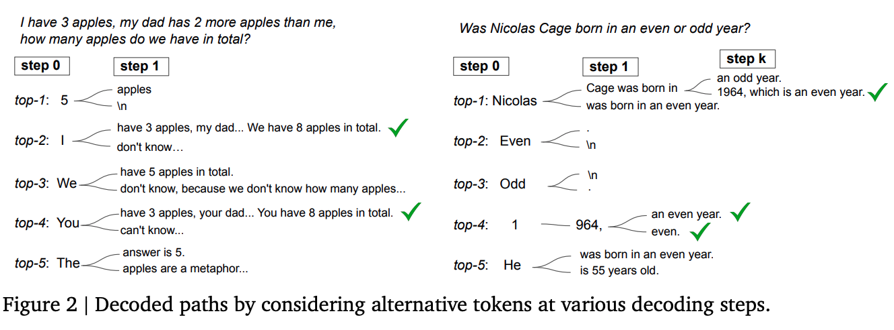
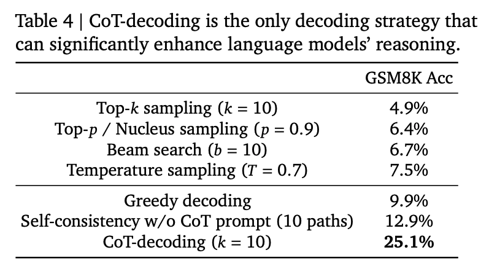
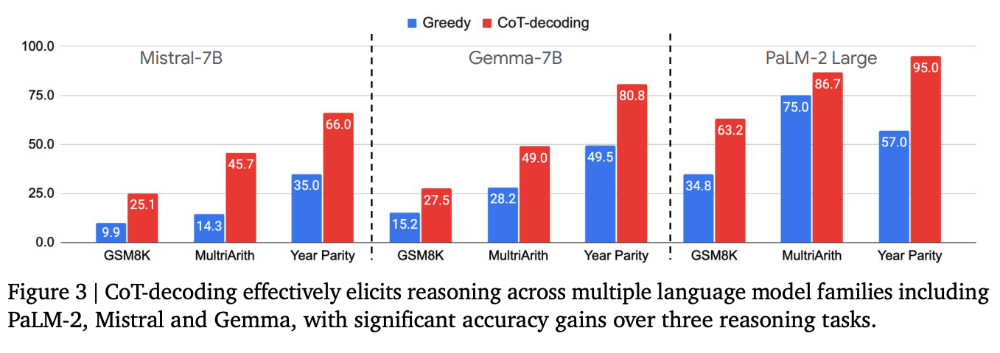

## Motivation

**Problem:**   
Current Chain-of-Thought (CoT) reasoning in LLMs is typically elicited via prompt engineering (few-shot, zero-shot, instruction tuning).

**Issues with prompting:**  
• Requires manual, task-specific engineering  
• Hard to separate model's intrinsic reasoning ability, or if they are just mimicking human-provided reasoning formats  
• Instruction-tuning with CoT data improves performance but is expensive

**Key Question:** Can LLMs reason without prompting?

**Traditional decoding (greedy search):**  
• Outputs short, direct answers  
• When decoding via top-1 token selection, model often jumps straight to an answer without showing reasoning steps

**CoT decoding:**  
• Explores **top-k alternative tokens** during generation  
• Many reasoning paths are inherent in the model, just not revealed in greedy decoding

---

## Methods

**CoT Decoding Process:**  

• **Step 1:** At the first decoding step, branch into top-k tokens  
• **Step 2:** Continue greedy decoding along each branch  
• **Step 3:** Extract CoT paths by ranking with a confidence metric:  
   Compute Δ = average margin between top-1 and top-2 probabilities for answer tokens  
   Higher Δ → model more confident → often corresponds to a valid CoT path  
• **Step 4:** Pick the decoding path with highest Δ (or aggregate across paths)  
    This reliably identifies reasoning-consistent outputs  
    **Similar to self-consistency, but without the prompts**

---

## Experiment

**Models Tested:**
• PaLM-2 (X-Small → Large)
• Mistral-7B
• Gemma-7B
• Pre-trained and instruction-tuned variants

**Tasks/Datasets:**
• **Math:** GSM8K, MultiArith
• **Commonsense:** Year Parity
• **Symbolic reasoning:** Coin Flips, Web of Lies, Multi-step Arithmetic (Big-Bench-Hard)
• **Synthetic tasks:** Sports Understanding, Object Counting

---

## Findings

**Key Results:**
• CoT reasoning can be elicited **without explicit prompts**
• LLMs already learn reasoning patterns during pretraining
• Using greedy decoding underestimates a model's true reasoning ability

**Future Directions:**  
• **Adaptive Branching:** Decide dynamically when and where to branch during decoding. 
• **Training integration:** Use discovered CoT paths as training signals for fine-tuning. 

**Comparative Analysis:**  
• **Greedy decoding:** Fast but hides reasoning.   
• **Top-k, top-p, beam search:** Increase diversity but not reasoning accuracy.  
• **Self-consistency:** Needs CoT prompts, aggregates across multiple outputs.  
• **CoT-decoding:** Purely decoding-based, unsupervised, more faithful measure of intrinsic reasoning ability.  
• **Hybrid (CoT-decoding + prompting):** Best of both worlds; achieves state-of-the-art reasoning accuracy.  

**Note:**  
• **CoT-SC** aggregates prompt-elicited reasoning trajectories. 
• **CoT-Decoding** uncovers and aggregates intrinsic reasoning trajectories that emerge naturally in the decoding process without any prompt or instruction-tuning. 

---

## References
• *Chain-of-Thought Reasoning Without Prompting*. arXiv: [https://arxiv.org/abs/2402.10200](https://arxiv.org/abs/2402.10200)

