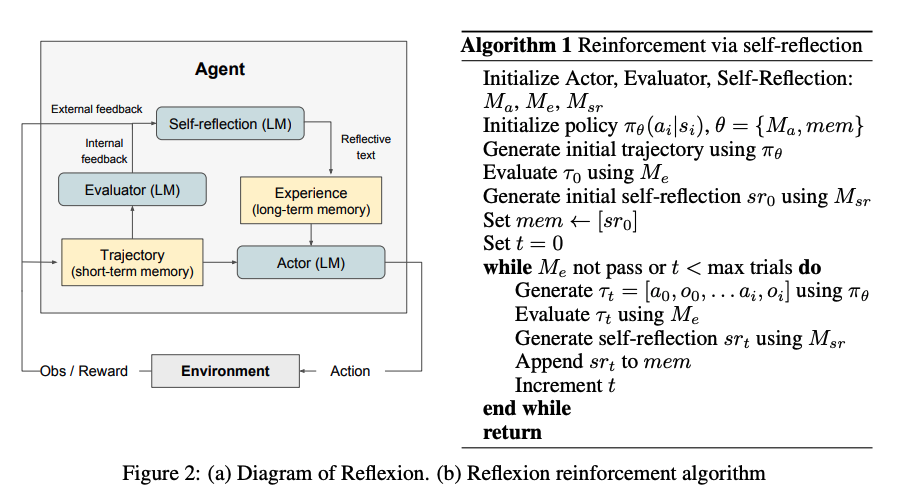
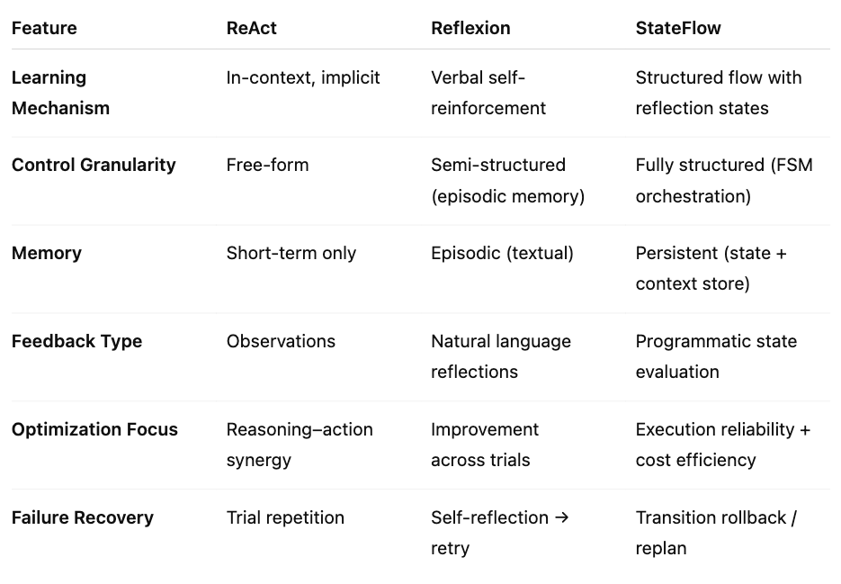

## Motivation
LLMs are increasing used as autonomous agents (e.g., in games, APIs, or reasoning tasks). However:  
• Reinforcement Learning methods require expensive fine-tuning and large training data. 
• In-context learning alone provides weak persistent improvement across trials. 

**Summary** 
Key Idea: Verbal Reinforcement  
The authors introduce Reflexion, a framework that replaces parameter updates with linguistic self-feedback. Agents verbally reflect on previous trials' successes or failures, store their their reflections in episodic memory, and use them to improve decisions in future attempts.

## Core Mechanism
Reflxion consists of three LLM-based modules:  
Actor - Generates actions or text (the policy)  
Evaluator - Judges task success and gives a reward (binary, scalar, or textual)  
Self-reflection - Generates natural language feedback summarizing what went wrong and how to improve  

**Memory**:  
•  Short term memory: Current trajectory (actions and observations)  
• Long term memory: Accumulated textual reflections from prior trials. The Actor's next trial uses both memories as context.  
 

**Learning Process**

Algorithm follows an iterative reinforcement loop:  
Actor interacts with environment → trajectory τ₀.  
Evaluator computes reward r₀.  
Self-Reflection generates textual feedback sr₀.  
Memory updated: mem ← mem ∪ sr₀.  
Actor retries task with mem context until success or max trials.  
Effectively, Reflexion uses language-based “policy optimization”. 
—No weight updates, only context updates.  

**Limitations:**. 
• Local Minima: Reflexion can converge on suboptimal verbal strategies.  
• Memory Bound: Limited by LLM context window (only 1–3 reflections retained).  
• Evaluation Dependence: Success depends on reliability of evaluators and test cases.  
• Task Diversity: Reflexion struggles in high-entropy tasks like WebShop, which require creativity and open exploration.  

**Borader Impact:**   
• Increases transparency of RL: self-reflections are interpretable traces of reasoning.  
• Enables diagnosable AI behavior, aiding safety audits.  
• However, amplifies autonomy risks—if reflection text is misaligned, agent may reinforce undesired behavior.  

**Comparison**   

## References
• Reflexion: Language Agents with Verbal Reinforcement Learning. arXiv: [https://arxiv.org/pdf/2303.11366]

