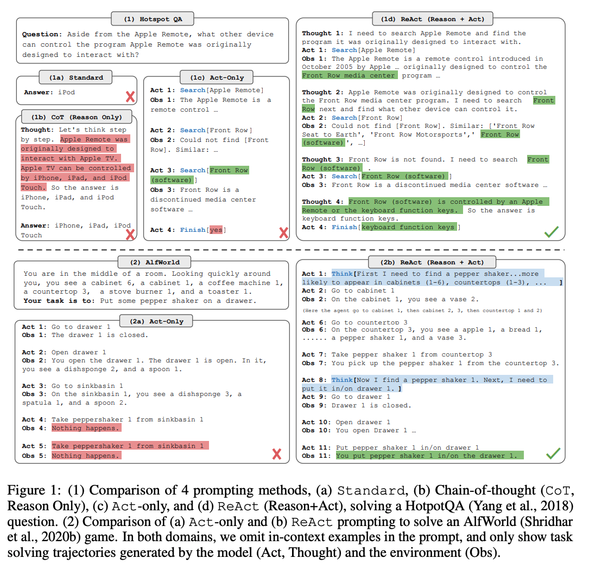
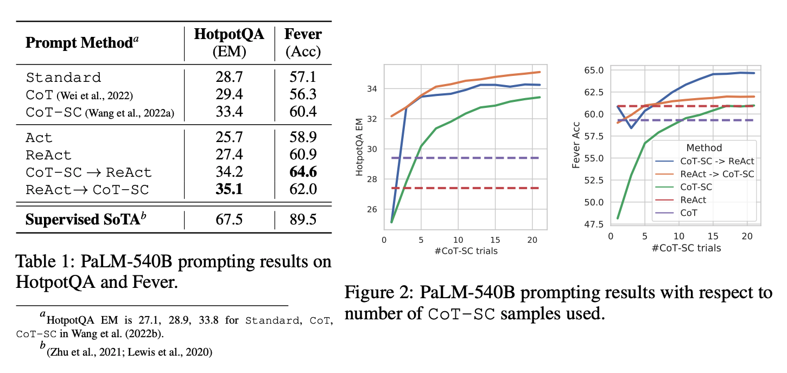

## Motivation

**Summary** 

• ReAct stands for Reasoning + Acting. Traditional prompting often makes an LLM either: reason (CoT, logic, planning), or act (produce an action such as tool calling or retrieving information).  
• ReAct combines the two in a single framework: the model can reason, then act, then reason again, similar to how humans solve tasks interactively. 

**Problem**

• Chain-of-thought reasoning is a static black box, in that the model uses
its own internal representations to generate thoughts and is not grounded in the external world, which limits its ability to reason reactively or update its knowledge. This can lead to issues like fact hallucination and error propagation over the reasoning process.

**Why This Matters**

• There have not been studies on how reasoning and acting can be combined in a synergistic manner for general task solving, and if such a combination can bring systematic benefits compared to reasoning or acting alone.  
• ReAct offers a way to combine both modes, making them more useful for real-world tasks (search + reasoning, planning + execution, or interactive decision making).  
• It’s a step toward more agent-like LLMs, which can reason, act, observe results, and adapt.  

**TDLR;** 

ReAct prompts LLMs to generate both verbal reasoning traces and actions pertaining to a task in an **interleaved manner**, which allows the model to perform dynamic reasoning to create, maintain, and adjust high-level plans for acting (reason to act), while also interact with the external environments (e.g. Wikipedia) to incorporate additional information into reasoning (act to reason).  

---

## Methods

**ReAct Formulation:**

• Consider a standard agent loop: at time t, the agent sees observation oₜ and chooses action aₜ per policy π(aₜ|cₜ), where cₜ is the entire trajectory so far (all past observations and actions plus the current observation).  
• Expand the action space from A (external actions) to  = A ∪ L, where L is the space of language thoughts (internal “notes to self”). L does not alter external environment but update the context.  
• By allowing "think steps”: The agent can decompose goals, plan, recap what it just saw, inject background knowledge and update its plan—all in its own words—before choosing the next real action. This reduces blind moves and tool-use hallucinations.

**What this looks like in practice**
Task: “Who wrote The Selfish Gene and what year was it published?”  
Observation o¹: The question text.  
Thought â¹: “Plan: search for the book, then extract author and year.”  
Action a¹: search("The Selfish Gene author"). 
Observation o²: Search results snippet shows “Richard Dawkins”.   
Thought â²: “Author found; now get publication year.”  
Action a²: open("The Selfish Gene Wikipedia").  
Observation o³: Page shows “Published in 1976.”  
Thought â³: “We have author and year; compose answer.”  
Action a³ (final): “Richard Dawkins, 1976.”  
Notice how thoughts don’t change the environment; they just clarify and steer the next step.  

The paper focuses on a frozen LLM (PaLM-540B) with few-shot **in-context trajectories** that interleave Thought/Action/Observation.  

Two patterns the paper highlights:   
• Reasoning-heavy tasks (e.g., multi-hop QA, fact-checking): Alternate Thought → Action → Observation, repeatedly.  
• Decision-heavy tasks (e.g., games, web navigation): Thoughts appear only when useful (sparsely), and the model decides when to insert them.  

---

## Experiment

Setup & action space. The model interacts with a minimal Wikipedia API:
(1) search[entity] returns first 5 sentences or suggestions; (2) lookup[string] returns the next sentence containing a string (like Ctrl+F); (3) finish[answer]. The API forces explicit, step-wise retrieval and reasoning rather than relying on a powerful retriever. 

Few-shot prompts. 6 (HotpotQA) and 3 (FEVER) ReAct trajectories with dense thoughts were hand-crafted; thoughts include goal decomposition, extracting facts, commonsense or arithmetic checks, search reformulation, and synthesis.

Hybrids win: ReAct→CoT-SC (HotpotQA best) and CoT-SC→ReAct (FEVER best).  

---

## Findings

Why hybridization helps (error analysis). Manual labeling of successes/failures shows:

CoT hallucinates facts more (false positives and major failure mode), ReAct is more grounded but suffers more reasoning errors (e.g., loops or weak search) due to its structural constraints—hence the benefit of combining internal CoT with externally grounded ReAct. 

Switching heuristics. If ReAct can’t answer within a small step budget, fall back to CoT-SC; if CoT-SC has weak consensus, fall back to ReAct. This reaches CoT-SC-level performance with far fewer samples (3–5 vs 21).

**Key Results:**

---

## References
• 
